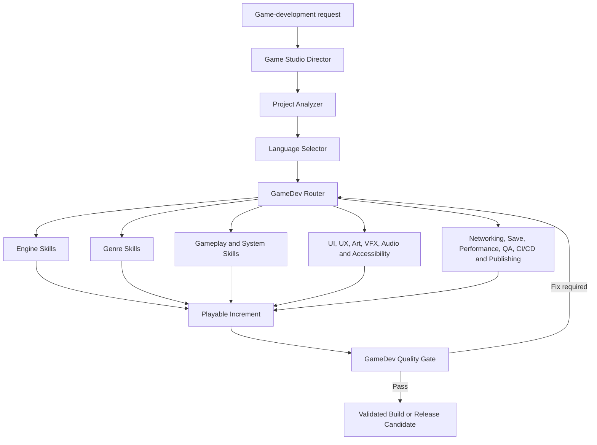
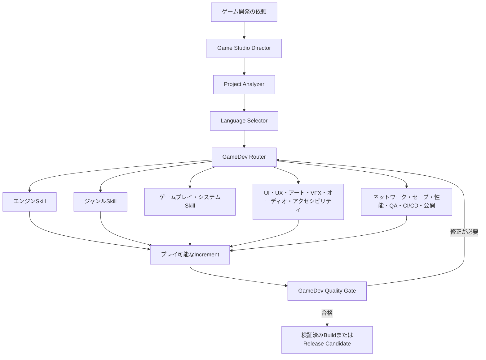

# Game Dev Super Stack

A portable Agent Skills stack for planning, building, validating, and shipping games across Unity, Unreal Engine, Godot, Roblox, Bevy, Phaser, PixiJS, Three.js, pygame, LÖVE, and custom engines.

## Development and AI authorship

The author develops and maintains this project in a **Codex × Antigravity** environment. The entire project was created using AI, including its planning, architecture, original Skill design, implementation, documentation, localization, tests, and validation workflows. Human direction, review, and release decisions are combined with AI-driven production and verification.

This repository also includes 28 pinned upstream Apache-2.0 Skills. Those components retain their original authorship and license attribution in [THIRD_PARTY_NOTICES.md](THIRD_PARTY_NOTICES.md); the statement above describes how this stack was assembled, extended, documented, and maintained.

## Skill architecture



## What is included

- 109 independently discoverable Agent Skills
- 28 pinned Apache-2.0 upstream skills and 81 original skills
- Game Studio Director, Project Analyzer, Language Selector, Router, and Quality Gate
- Engine, genre, gameplay, networking, UI/UX, VFX, audio, accessibility, performance, QA, CI/CD, and publishing coverage
- 17 routing fixtures and a zero-dependency Python validator
- Shared `.agents/skills` layout for multiple AI coding agents

## Quick start

Clone this repository into or beside your game project, copy `.agents`, `scripts`, and `tests` into the project root, then run:

```bash
python scripts/validate_stack.py
python scripts/gamedev_router.py "four-player online survival crafting game with a dedicated server" --engine unreal
```

Expected validation result:

```text
skills=109 fixtures=17 errors=0
```

## Installation

- Japanese one-file AI installer: [INSTALL_JA.md](INSTALL_JA.md)
- English one-file AI installer: [INSTALL_EN.md](INSTALL_EN.md)
- Architecture: [docs/architecture.md](docs/architecture.md)
- Coverage matrix: [docs/coverage-matrix.md](docs/coverage-matrix.md)
- Source and license lock: [docs/source-lock.md](docs/source-lock.md)
- Validation evidence: [docs/validation-report.md](docs/validation-report.md)

## Supported AI clients

The canonical project location is `.agents/skills`. The distribution includes setup notes for OpenAI Codex, Claude Code, Cursor, Gemini CLI, Google Antigravity, GitHub Copilot, and other Agent Skills-compatible clients.

Every Markdown source has explicit English (`*.en.md`) and Japanese (`*.ja.md`) companions. `SKILL.md` remains the canonical Agent Skills entry point for tool compatibility.

## Safety

The Router performs selection only. Publishing, deployment, purchases, credential use, and production or player-data mutation require explicit approval at the point of action. Never commit secrets.

## License

Original Game Dev Super Stack content is licensed under Apache License 2.0. Vendored skills retain their upstream Apache-2.0 attribution; see [THIRD_PARTY_NOTICES.md](THIRD_PARTY_NOTICES.md).

---

# Game Dev Super Stack（日本語）

Unity、Unreal Engine、Godot、Roblox、Bevy、Phaser、PixiJS、Three.js、pygame、LÖVE、独自エンジンにおけるゲームの企画、開発、検証、リリースを支援する、持ち運び可能なAgent Skillsスタックです。

## 開発環境とAIによる制作

作者本人が**Codex × Antigravity**環境で本プロジェクトを開発・保守しています。企画、アーキテクチャ、独自Skillの設計、実装、文書、翻訳、テスト、検証Workflowを含む、本プロジェクトのすべてをAIを使用して制作しました。人間による方針決定、レビュー、公開判断と、AIによる制作・検証を組み合わせています。

このリポジトリには、バージョンを固定したApache-2.0の外部Skill 28個も含まれています。それらの原著作者とライセンス帰属は[THIRD_PARTY_NOTICES.md](THIRD_PARTY_NOTICES.md)に維持されています。上記の説明は、本Stackの構成、拡張、文書化、保守を行った制作工程について示すものです。

## Skill構成図



## 収録内容

- 個別に検出可能な109個のAgent Skills
- バージョンを固定したApache-2.0の外部Skill 28個と、独自Skill 81個
- Game Studio Director、Project Analyzer、Language Selector、Router、Quality Gate
- エンジン、ジャンル、ゲームプレイ、ネットワーク、UI/UX、VFX、オーディオ、アクセシビリティ、パフォーマンス、QA、CI/CD、公開作業を網羅
- 17個のルーティングfixtureと、外部依存のないPython validator
- 複数のAIコーディングエージェントで共有できる`.agents/skills`構成

## クイックスタート

このリポジトリをゲームプロジェクト内または隣接する場所へcloneし、`.agents`、`scripts`、`tests`をプロジェクトルートへコピーしてから、次を実行します。

```bash
python scripts/validate_stack.py
python scripts/gamedev_router.py "four-player online survival crafting game with a dedicated server" --engine unreal
```

期待される検証結果:

```text
skills=109 fixtures=17 errors=0
```

## 導入

- 日本語の一枚完結AI導入書: [INSTALL_JA.md](INSTALL_JA.md)
- 英語の一枚完結AI導入書: [INSTALL_EN.md](INSTALL_EN.md)
- アーキテクチャ: [docs/architecture.md](docs/architecture.md)
- 対応範囲一覧: [docs/coverage-matrix.md](docs/coverage-matrix.md)
- ソースとライセンスの固定情報: [docs/source-lock.md](docs/source-lock.md)
- 検証結果: [docs/validation-report.md](docs/validation-report.md)

## 対応AIクライアント

標準のプロジェクト配置先は`.agents/skills`です。この配布物には、OpenAI Codex、Claude Code、Cursor、Gemini CLI、Google Antigravity、GitHub Copilot、その他のAgent Skills互換クライアント向けのセットアップ情報が含まれています。

すべてのMarkdown正本には、英語版（`*.en.md`）と日本語版（`*.ja.md`）があります。ツール互換性を維持するため、Agent Skillsの正式なエントリーポイントは`SKILL.md`です。

## 安全性

RouterはSkillの選択だけを行います。公開、デプロイ、購入、認証情報の使用、本番データまたはプレイヤーデータの変更には、その操作時点で明示的な承認が必要です。秘密情報をcommitしないでください。

## ライセンス

Game Dev Super Stackの独自コンテンツはApache License 2.0で提供されます。取り込まれたSkillには、それぞれのApache-2.0帰属表示が維持されています。詳細は[THIRD_PARTY_NOTICES.md](THIRD_PARTY_NOTICES.md)を参照してください。
